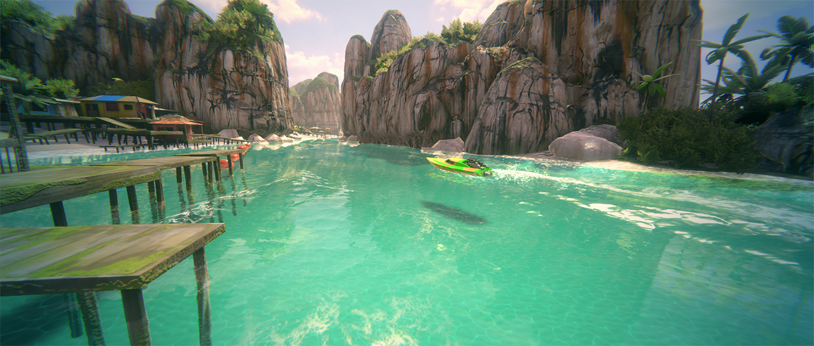

# About the Universal Render Pipeline

The Universal Render Pipeline (URP) is a prebuilt Scriptable Render Pipeline, made by Unity. The technology offers graphics that are scalable to mobile platforms, and you can also use it for higher-end consoles and PCs. You’re able to achieve quick rendering at a high quality without needing compute shader technology. URP uses simplified, physically based Lighting and Materials.

The URP uses single-pass forward rendering. Use this pipeline to get optimized real-time performance on several platforms. 

The URP is supported on the following platforms:
* Windows and UWP
* Mac and iOS
* Android
* XBox One
* PlayStation4
* Nintendo Switch
* WebGL
* All current VR platforms

The Universal Render Pipeline is available via two templates: URP and URP-VR. The  URP-VR comes with pre-enabled settings specifically for VR. The documentation for both render pipelines is the same. For any questions regarding URP-VR, see the URP documentation.

**Note:**  Built-in and custom Lit Shaders do not work with the Universal Render Pipeline. Instead, URP has a new set of standard Shaders. If you upgrade a Project from the Built-in render pipeline to URP, you can [upgrade Built-in Shaders to the URP ones](upgrading-your-shaders.md).

**Note:** Projects made using URP are not compatible with the High Definition Render Pipeline or the Built-in Unity render¢pipeline. Before you start development, you must decide which render pipeline to use in your Project. 